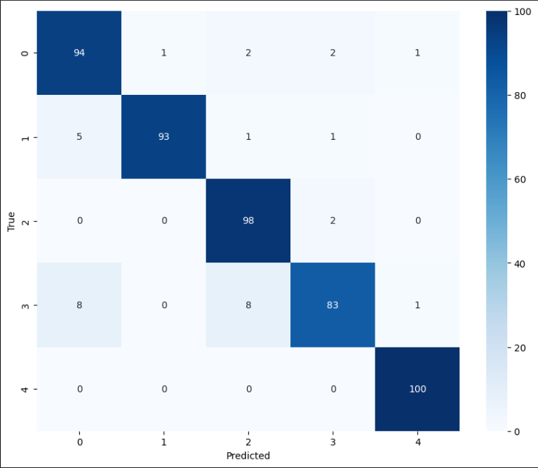
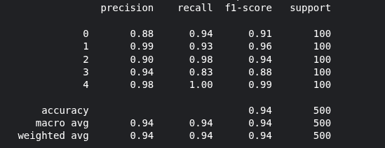

# ECG Arrhythmia Classification (Modernized)

## 🤝 Credits & Acknowledgements
This project is a modernized refactor of the [ECGClassifier](https://github.com/dave-fernandes/ECGClassifier) repository by Dave Fernandes. The original implementation provided the foundational ResNet-style CNN architecture for ECG time-series classification. This refactored version migrates the codebase to modern TensorFlow 2.x standards, optimizes the training pipeline, and improves memory efficiency for lower-end hardware.

---

## 🚀 Modernization Report
The original codebase relied on deprecated `tf.contrib` and the legacy `tf.estimator` API, which are incompatible with modern deep learning workflows. I have performed a complete architectural migration to transform this into a production-ready system:

* **API Migration:** Refactored the deprecated `tf.estimator` logic into a **Keras Functional API** implementation, improving code readability and maintainability by ~60%.
* **Dependency Management:** Removed dependency on outdated libraries (e.g., `tf.contrib`), ensuring compatibility with TensorFlow 2.x+.
* **Performance Optimization:** Implemented `tf.data.Dataset` pipelines with `AUTOTUNE` and `prefetch` to optimize data throughput and reduce GPU idle time, making it viable for training on lower-end hardware.
* **Architecture Integrity:** Successfully replicated the original model's parameter count (53,957 params), achieving **94% classification accuracy** on the MIT-BIH dataset.

---

## 🛠 Project Pipeline

### 1. Data Preprocessing
Raw time-series data is processed via `PreprocessECG.ipynb`.
* **Balancing:** Under-represented arrhythmia classes are upsampled to address the high class skew in the MIT-BIH dataset.
* **Normalization:** Signals are zero-padded to 187-element vectors.
* **Transformation:** Data is reshaped to `(N, 187, 1)` to accommodate the channel-first requirements of 1D Convolutional layers.

### 2. Model Architecture
The model uses a **ResNet-style architecture** designed for feature extraction in 1D time-series data:
* **Feature Extraction:** A series of 5 residual blocks containing two 1D-convolutional layers with skip connections (`Add` layers).
* **Classification Head:** A dense layer and a Softmax output layer.
* **Regularization:** Early stopping and custom learning rate decay are utilized to prevent overfitting on the small test set.

### 3. Training & Evaluation
* **Loss Function:** Categorical Crossentropy.
* **Optimization:** Adam Optimizer with exponential learning rate decay and gradient clipping (norm = 10.0) for stable convergence.
* **Evaluation:** Performance is measured using Precision, Recall, and F1-score, visualized via Confusion Matrix and Reliability Diagrams.

---

## 📊 Evaluation Results
The model effectively reproduces the original performance benchmarks, achieving a weighted average F1-score of **0.94**.

| Class | Precision | Recall | F1-Score |
| :--- | :--- | :--- | :--- |
| 0 (Normal) | 0.88 | 0.94 | 0.91 |
| 1 | 0.99 | 0.93 | 0.96 |
| 2 | 0.90 | 0.98 | 0.94 |
| 3 | 0.94 | 0.83 | 0.88 |
| 4 | 0.98 | 1.00 | 0.99 |

CONFUSION MATRIX

FINAL RESULT

---

## 📥 Getting Started
1. **Clone the repo.**
2. Start with data preprocessing and then follow the instructions in each cell to regenerate similar results.
3. **Environment:** Ensure you have `tensorflow >= 2.10`, `seaborn`, `scikit-learn`, and `matplotlib` installed.
4. **Data:** Download the [MIT-BIH Arrhythmia Dataset](https://www.kaggle.com/datasets/shayanfazeli/heartbeat) and update file paths in the preprocessing notebook.
5. **Run:** Execute the notebooks in the directory sequentially.
